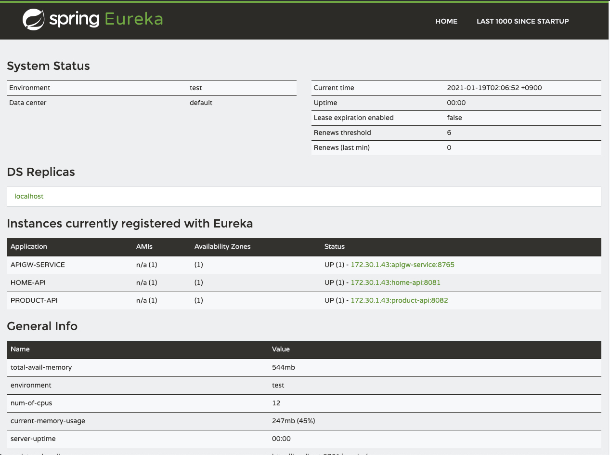

# Spring-Cloud-Config-MSA-Example

### localhost:8888/eureka-server/default

```json
{
  "name": "eureka-server",
  "profiles": [
    "default"
  ],
  "label": null,
  "version": "f33cd53e4b95dd9deac4512b404fa849efdcec79",
  "state": null,
  "propertySources": [
    {
      "name": "file:///Users/groot/config-msa-example/config/hardy/eureka-server/eureka-server.yml",
      "source": {
        "server.port": 8761,
        "spring.application.name": "eureka-server",
        "spring.freemarker.template-loader-path": "classpath:/templates/",
        "spring.freemarker.prefer-file-system-access": false,
        "eureka.client.service-url.defaultZone": "http://localhost:8761/eureka",
        "eureka.client.register-with-eureka": false,
        "eureka.client.fetch-registry": false,
        "eureka.instance.prefer-ip-address": true,
        "eureka.server.response-cache-update-interval-ms": 1000
      }
    }
  ]
}
```

### localhost:8888/apigw-service/default

```json
{
  "name": "apigw-service",
  "profiles": [
    "default"
  ],
  "label": null,
  "version": "f33cd53e4b95dd9deac4512b404fa849efdcec79",
  "state": null,
  "propertySources": [
    {
      "name": "file:///Users/groot/config-msa-example/config/hardy/apigw-service/apigw-service.yml",
      "source": {
        "spring.application.name": "apigw-service",
        "server.port": 8765,
        "zuul.routes.home-api.path": "/home/**",
        "zuul.routes.home-api.serviceId": "home-api",
        "zuul.routes.home-api.stripPrefix": false,
        "zuul.routes.product-api.path": "/product/**",
        "zuul.routes.product-api.serviceId": "product-api",
        "zuul.routes.product-api.stripPrefix": false,
        "zuul.ribbon-isolation-strategy": "thread",
        "zuul.thread-pool.use-separate-thread-pools": true,
        "zuul.thread-pool.thread-pool-key-prefix": "zuul-",
        "eureka.instance.prefer-ip-address": true,
        "eureka.client.service-url.defaultZone": "http://localhost:8761/eureka",
        "hystrix.command.default.execution.isolation.thread.timeoutInMilliseconds": 12000,
        "ribbon.MaxAutoRetriesNextServer": 1
      }
    }
  ]
}
```

### localhost:8888/home-api/default

```json
{
  "name": "home-api",
  "profiles": [
    "default"
  ],
  "label": null,
  "version": "f33cd53e4b95dd9deac4512b404fa849efdcec79",
  "state": null,
  "propertySources": [
    {
      "name": "file:///Users/groot/config-msa-example/config/hardy/home-api/home-api.yml",
      "source": {
        "spring.application.name": "home-api",
        "eureka.client.register-with-eureka": true,
        "eureka.client.fetch-registry": true,
        "eureka.client.service-url.defaultZone": "http://localhost:8761/eureka",
        "eureka.instance.prefer-ip-address": true,
        "hystrix.command.default.execution.isolation.strategy": "THREAD",
        "hystrix.command.default.execution.isolation.thread.timeoutInMilliseconds": 12000,
        "hystrix.threadpool.default.coreSize": 10,
        "hystrix.threadpool.default.maximumSize": 50,
        "hystrix.threadpool.default.allowMaximumSizeToDivergeFromCoreSize": true,
        "feign.hystrix.enabled": true,
        "ribbon.MaxAutoRetries": 0,
        "ribbon.MaxAutoRetriesNextServer": 1
      }
    }
  ]
}
```

### localhost:8888/product-api/default

```json
{
  "name": "product-api",
  "profiles": [
    "default"
  ],
  "label": null,
  "version": "f33cd53e4b95dd9deac4512b404fa849efdcec79",
  "state": null,
  "propertySources": [
    {
      "name": "file:///Users/groot/config-msa-example/config/hardy/product-api/product-api.yml",
      "source": {
        "spring.application.name": "product-api",
        "eureka.client.register-with-eureka": true,
        "eureka.client.fetch-registry": true,
        "eureka.client.service-url.defaultZone": "http://localhost:8761/eureka",
        "eureka.instance.prefer-ip-address": true,
        "hystrix.command.default.execution.isolation.strategy": "THREAD",
        "hystrix.command.default.execution.isolation.thread.timeoutInMilliseconds": 12000,
        "hystrix.threadpool.default.coreSize": 10,
        "hystrix.threadpool.default.maximumSize": 100,
        "hystrix.threadpool.default.allowMaximumSizeToDivergeFromCoreSize": true,
        "feign.hystrix.enabled": true
      }
    }
  ]
}
```

---

### eureka dashboard (localhost:8761)

